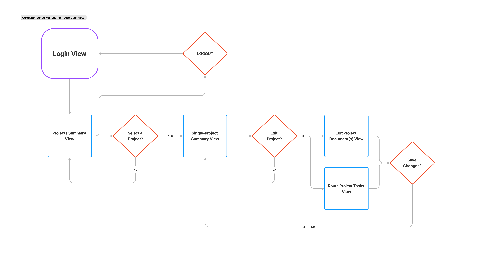

# Action Request Tracking System

## Overview

### Project Structure
This project is patterned after the docker-compose-app and contains three folders:
- `/backend` contains the DRF application and its Dockerfile.
- `/frontent` contains the React application.
- `/webserver` contains the nginx-server configuration file and its Dockerfile.

The remaining files run shell commands for compiling the project in either development mode or production mode.

### Application Structure
Refer to the "Project Flow" diagram. The application terminates at the "load projects view" stage of the flow.

The "User Flow" diagram below shows the same process from the context of the user's experience.
